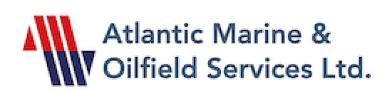

# Atlantic-marine  

Atlantic Marine & Oilfield Services is a Subsea Engineering - Diving Company since 1999. She is an ISO 9001-2015. Atlantic Marine is also an ABS, Bureau Veritas, and Lloyds Class In–Water Survey Company.

Atlantic Marine is fully equipped with Classed Air Dive Spread Equipment, Inspection Class ROVs, Robot-aided Subsea Engineering Tooling and Equipment, Zone 2 Offshore Work Containers, Divers Launch and Recovery Spread, and Subsea Inspection, Construction and Welding Equipment.

And with the recent purpose-built LightDiveBoat (LDB) acquisition, MV. Eghenoflorence, Atlanticmarine can mobilize on very short notice for most dive operations.

Atlantic Marine has its head office in Lagos, Nigeria, a Yard base in Port-Harcourt, Nigeria, and a satellite office in Accra, Ghana.

